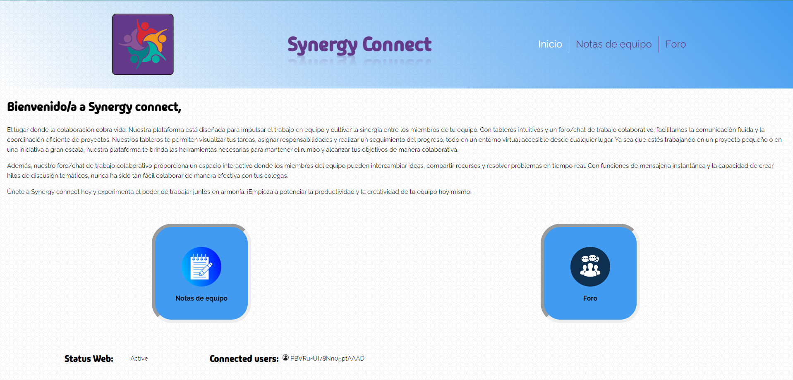
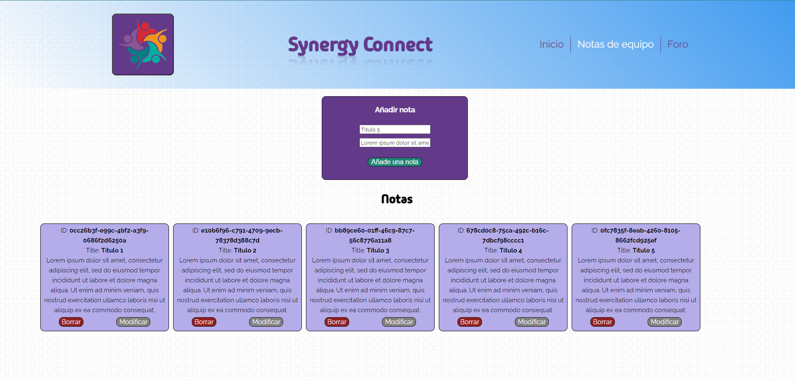
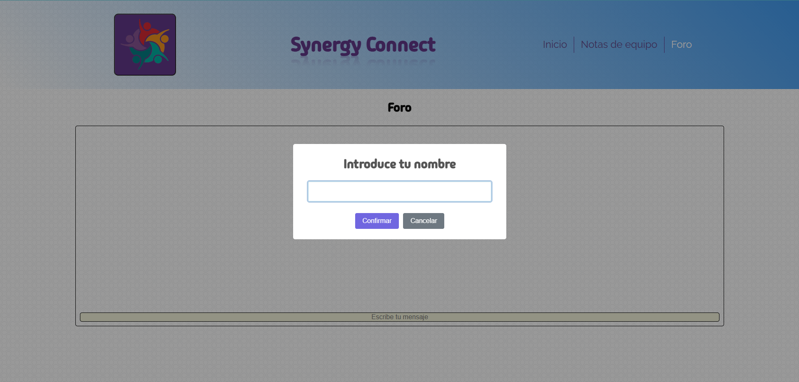
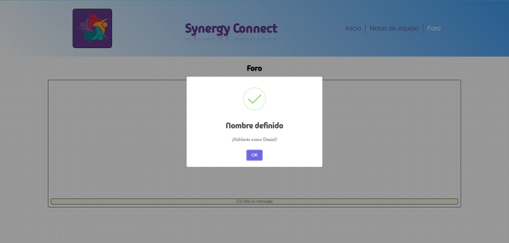
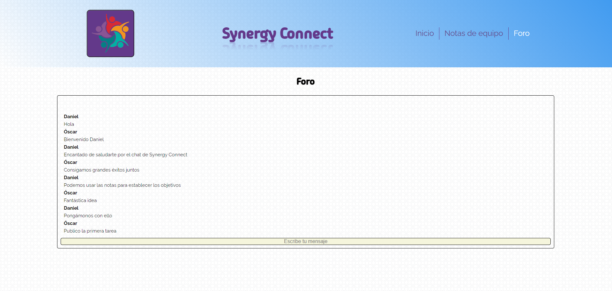

# Synergy Connect

Synergy Connect es una aplicación web construida con Vue.js y TypeScript, diseñada para mejorar la colaboración y comunicación dentro de equipos de trabajo. La aplicación utiliza WebSockets para permitir una comunicación en tiempo real entre los usuarios conectados.
En el backend (que está en otro repositorio) contaremos con los servicios para utilizar las funciones propias de un CRUD de notas que se gestionarán con la base de datos de Mongo DB. También existirán las funciones para gestionar información acerca de los usuarios conectados. 
El lado del cliente por su parte contará con 3 secciones en la web:
1ª Información y explicación de la web, donde se podrán consultar las personas conectadas al dominio
2ª Tablero de notas con las tareas por hacer
3ª Foro donde cualquier persona pueda escribir un mensaje para todas las personas conectadas.

## Características principales

- **Información y explicación:** Proporciona información sobre la aplicación y permite consultar las personas conectadas al dominio.
- **Tablero de notas:** Permite a los usuarios crear y gestionar tareas por hacer en un tablero colaborativo.
- **Foro:** Facilita la comunicación entre todos los usuarios conectados a través de un sistema de mensajes en tiempo real.

## Estructura del proyecto

El proyecto sigue una estructura modular, con la lógica del WebSocket y la conexión al servidor almacenada en la carpeta `services`.

- **`/services`:** Contiene la lógica del WebSocket y la conexión con el servidor.

## Instalación

1. Clona el repositorio desde GitHub:

```
git clone https://github.com/danielbzg/synergy-connect-client.git
```

2. Instala las dependencias de node:

```
npm install
```

## Uso

1. Inicia el servidor del cliente:

```
npm run dev
```

2. Accede a la aplicación en tu navegador:

```
http://localhost:5173
```

Obviamente para utilizar las funcionalidades tendrás que levantar docker y el servidor que contiene toda la lógica del proyecto de Backend:
```
https://github.com/Danielbzg/synergy-connect-server
```


## Contribución

¡Las contribuciones son bienvenidas! Si deseas contribuir a Synergy Connect, sigue estos pasos:

1. Haz un fork del repositorio.
2. Crea una nueva rama (`git checkout -b feature/feature-name`).
3. Realiza tus cambios y haz commits (`git commit -am 'Add new feature'`).
4. Haz push de tus cambios a la rama (`git push origin feature/feature-name`).
5. Abre un Pull Request.


## Futuras implementaciones

1. Notificaciones en tiempo real: Amplía el sistema de WebSocket para incluir notificaciones en tiempo real, como alertas para nuevas tareas asignadas, mensajes en el foro, o actualizaciones en el tablero de notas. 
2. Funciones de búsqueda y filtrado en todas las secciones de la aplicación para que los usuarios puedan encontrar rápidamente la información que necesitan, ya sea en el tablero de notas, el foro o la lista de usuarios conectados.
3. Poder cambiar el nombre en el foro. 
4. Que haya una persistencia de mensajes en el chat más allá de que se cierre el navegador o no, ya que ahora mismo solo se conservan los mensajes mientras estés conectado, si cierras el navegador pierdes los mensajes.
5. Personalización de temas y estilos para que los usuarios puedan ponerla a su gusto.
6. Soporte multilingüe.
7. Soporte para archivos adjuntos.
8. Funcionalidades de usuario avanzadas: Implementa funcionalidades como la gestión de usuarios, perfiles de usuario personalizados, autenticación y autorización para garantizar la seguridad y la privacidad de los datos de los usuarios.

## Capturas de la aplicación





